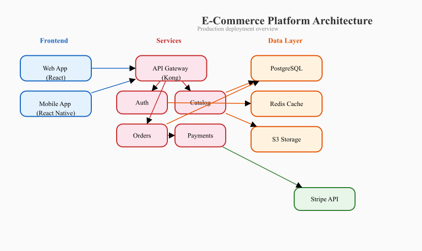
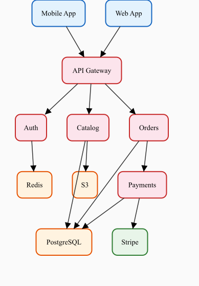
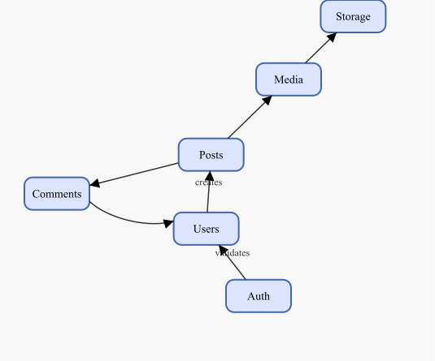
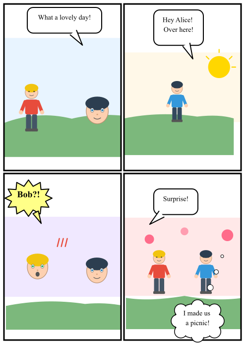
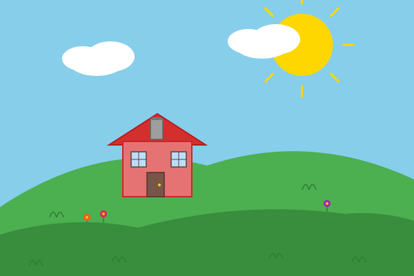
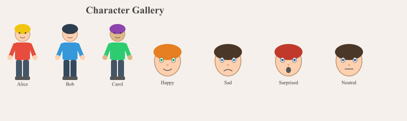
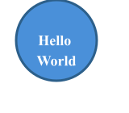

# aipencil

A CLI tool that renders structured JSON scene descriptions to SVG and PNG graphics. Designed to give AI systems a deterministic, consistent, and inexpensive way to produce images — from simple diagrams to character illustrations, manga pages, and paintings.

No explicit sizes or positions required. Define content and relationships; the engine computes the layout.

## Why?

AI image generation today relies on diffusion models that are expensive, inconsistent, and hard to control precisely. `aipencil` takes a different approach: describe what you want in structured JSON, get exactly that as output. Same input always produces the same image. No randomness, no hallucinated details, no GPU required.

## Showcase

### Architecture diagram (ranked layout)

Define nodes, connections, and styles. The ranked layout engine automatically assigns depth-based ranks and minimizes edge crossings. No coordinates or sizes specified — boxes auto-size from text.

```json
{"type": "group", "layout": {"type": "ranked", "gap": 55, "align": "LR"}, "children": [
  {"id": "web", "type": "group", "layout": {"type": "stack"}, "children": [
    {"type": "rect", "class": "frontend"},
    {"type": "text", "text": "Web App", "align": "center"}
  ]},
  {"id": "gateway", "type": "group", "layout": {"type": "stack"}, "children": [
    {"type": "rect", "class": "backend"},
    {"type": "text", "text": "API Gateway", "align": "center"}
  ]},
  {"type": "arrow", "from": "web", "to": "gateway"}
]}
```



<details>
<summary>View full JSON source</summary>

See [examples/architecture.json](examples/architecture.json)
</details>

### Ranked graph (top-to-bottom)



### Force-directed graph

For undirected or mesh-like graphs, the force-directed layout spreads nodes based on connectivity.



### Manga page

Panels with viewports, layers (background/characters/effects), speech bubbles targeting characters across viewport boundaries, and reusable patterns.



<details>
<summary>View JSON source</summary>

See [examples/manga.json](examples/manga.json)
</details>

### Painting (house on a hill)

Scene built from composable patterns (sun, cloud, house, flower, grass) on z-ordered layers, positioned with percentages.



<details>
<summary>View JSON source</summary>

See [examples/house_on_hill.json](examples/house_on_hill.json)
</details>

### Character patterns

Built-in `person` and `face` patterns with customizable colors and expressions.



### Simple shapes

```json
{"elements": [{"type": "group", "layout": {"type": "stack"}, "children": [
  {"type": "circle", "r": 50, "style": {"fill": "#4a90d9", "stroke": "#2c5f8a", "strokeWidth": 3}},
  {"type": "text", "text": "Hello\nWorld", "align": "center",
   "style": {"fill": "#ffffff", "fontSize": 18, "fontWeight": "bold"}}
]}]}
```



## Install

```bash
go install github.com/KarpelesLab/aipencil@latest
```

For PNG output, one of these must be available on your system:
- `rsvg-convert` (librsvg) — recommended
- `inkscape`
- `magick` (ImageMagick)

## Usage

```bash
# JSON from stdin to SVG on stdout
echo '{"elements":[...]}' | aipencil

# File input, SVG output
aipencil -o diagram.svg input.json

# PNG output (format inferred from extension)
aipencil -o output.png input.json

# PNG at 2x resolution
aipencil -o output.png -scale 2 input.json

# Validate without rendering
aipencil -validate input.json

# List built-in patterns
aipencil -list-patterns

# Run as MCP server (stdio transport)
aipencil -mcp
```

## Scene Description Format

```json
{
  "width": 800,
  "height": 600,
  "background": "#ffffff",
  "padding": 20,
  "styles": {},
  "defs": {},
  "elements": []
}
```

All top-level fields are optional. When `width`/`height` are omitted, the canvas auto-sizes to fit content.

### Element types

| Type | Description | Key fields |
|------|-------------|------------|
| `rect` | Rectangle (auto-sizes in stacks) | `width`, `height`, `rx` |
| `circle` | Circle | `r` |
| `ellipse` | Ellipse | `rx`, `ry` |
| `line` | Line segment | `x`, `y`, `x2`, `y2` |
| `path` | SVG path | `d` |
| `polygon` | Closed polygon | `points` |
| `polyline` | Open polyline | `points` |
| `text` | Text label | `text`, `fontSize`, `align`, `maxWidth` |
| `image` | Embedded image | `href` |
| `group` | Container | `children`, `layout`, `layers` |
| `viewport` | Scaled container | `children`, `layers`, `viewBox`, `clip` |
| `panel` | Clipped container with border | `children` |
| `arrow` | Connector between elements | `from`, `to`, `label`, `curve` |
| `bubble` | Speech/thought/shout bubble | `text`, `target`, `bubbleStyle` |
| `use` | Pattern instance | `pattern`, `params` |

### Auto-sizing

Rects in a `stack` layout auto-expand to fit sibling content. No explicit sizes needed for the common labeled-box pattern:

```json
{"type": "group", "layout": {"type": "stack"}, "children": [
  {"type": "rect", "class": "box"},
  {"type": "text", "text": "Auth Service", "align": "center"}
]}
```

The rect gets its size from the text measurement plus padding.

### Layouts

| Layout | Description | Options |
|--------|-------------|---------|
| `free` | Explicit positions (default) | |
| `row` | Horizontal left-to-right | `gap`, `align` |
| `column` | Vertical top-to-bottom | `gap`, `align` |
| `grid` | Grid with wrapping | `columns`, `gap` |
| `stack` | All children centered (layered) | |
| `ranked` | Layered directed graph (Sugiyama) | `gap`, `align` (`"LR"` for horizontal) |
| `graph` | Force-directed layout | |
| `constrained` | Constraint-solver driven | `rules` |

### Relative positioning

Position elements with percentages, anchors, or relative to other elements:

```json
{"position": {"x": "50%", "y": "50%", "anchor": "center"}}
{"position": {"below": "header", "gap": 20}}
{"position": {"rightOf": "sidebar", "alignY": "center"}}
{"position": {"centerOn": "background-rect"}}
```

Anchors: `top-left`, `top-center`, `top-right`, `center-left`, `center`, `center-right`, `bottom-left`, `bottom-center`, `bottom-right`.

### Constraint solver

Define linear relationships between element attributes:

```json
{"constraints": [
  {"attr": "width", "eq": "parent.width * 0.5"},
  {"attr": "left", "eq": "sidebar.right + 20"},
  {"attr": "centerX", "eq": "parent.centerX"},
  {"attr": "top", "gte": "header.bottom + 10"}
]}
```

Attributes: `left`, `right`, `top`, `bottom`, `width`, `height`, `centerX`, `centerY`. Operators: `eq`, `gte`, `lte`. Strength levels: `required` (default), `strong`, `medium`, `weak`.

### Layers

Z-ordered groups within any container. Each layer has its own layout. Elements can reference each other across layers.

```json
{"layers": [
  {"id": "background", "zIndex": 0, "elements": [...]},
  {"id": "characters", "zIndex": 10, "elements": [...]},
  {"id": "effects", "zIndex": 20, "elements": [...]}
]}
```

### Viewports

Containers with their own coordinate system. Content auto-scales to fit. Useful for comic panels and embedded scenes.

```json
{"type": "viewport", "width": 300, "height": 200, "clip": true, "children": [...]}
```

### Arrows

Connect elements by `id` with multiple routing styles:

```json
{"type": "arrow", "from": "nodeA", "to": "nodeB", "label": "HTTP", "curve": "smooth"}
```

- **Anchors**: `"nodeA.right"`, `"nodeA.top"`, etc.
- **Curves**: `straight`, `smooth` (bezier), `orthogonal` (right-angle)
- **Heads**: `filled`, `open`, `none`, `diamond`, `circle`

### Bubbles

Speech, thought, and shout bubbles with tails pointing at target elements:

```json
{"type": "bubble", "text": "Hello!", "target": "character1", "bubbleStyle": "speech"}
```

Styles: `speech` (rounded rect), `thought` (cloud with circle chain), `shout` (spiked starburst).

### Patterns / Templates

Reusable components defined in `defs` or loaded from built-ins. Parameters use `{{paramName}}` substitution:

```json
{
  "defs": {
    "badge": {
      "params": {"label": {"type": "string", "default": "OK"}},
      "width": 60, "height": 30,
      "elements": [
        {"type": "rect", "style": {"fill": "#4CAF50", "rx": 15}},
        {"type": "text", "text": "{{label}}", "align": "center", "style": {"fill": "#fff"}}
      ]
    }
  }
}
```

Built-in patterns: `face`, `person`, `box-with-label`. Run `aipencil -list-patterns` for details.

### Styles

Named styles referenced with `class`. Inline `style` overrides class:

```json
{
  "styles": {
    "box": {"fill": "#e8e8ff", "stroke": "#555", "strokeWidth": 2, "rx": 10}
  },
  "elements": [
    {"type": "rect", "class": "box"}
  ]
}
```

## MCP Server

Run as an [MCP](https://modelcontextprotocol.io) tool server for direct AI integration:

```bash
aipencil -mcp
```

Tools: `render` (scene to SVG/PNG), `validate` (check errors), `list_patterns` (available patterns).

## Regenerating examples

```bash
for f in examples/*.json; do
  aipencil -o "${f%.json}.png" -scale 2 "$f"
done
```

## License

MIT License. See [LICENSE](LICENSE).
